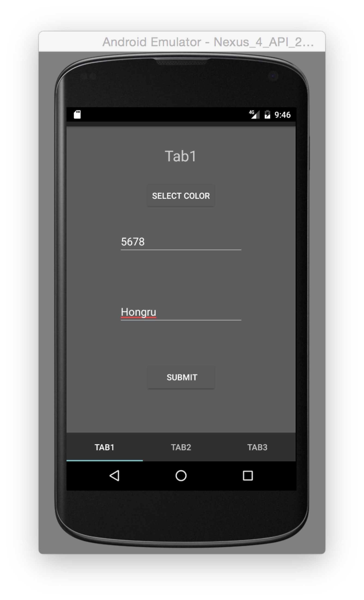
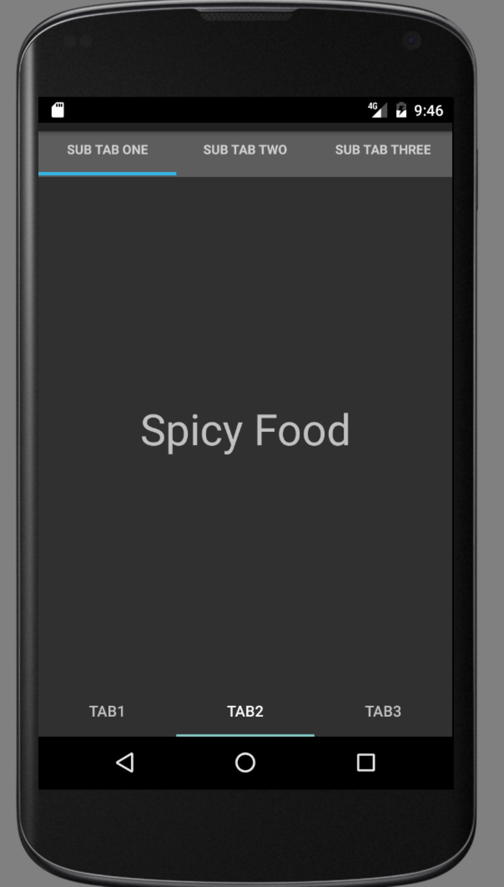
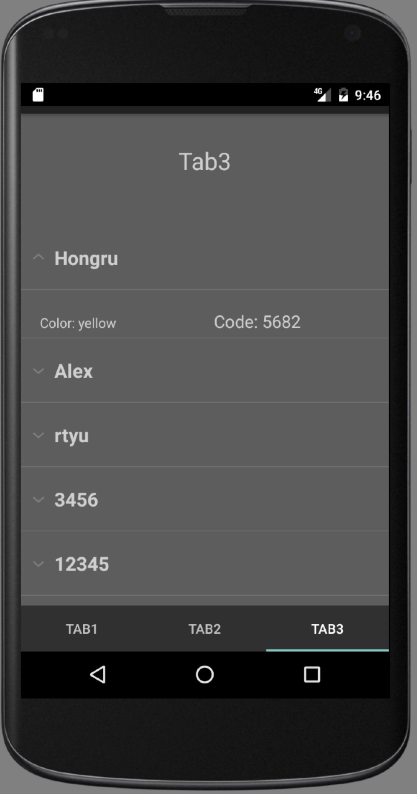

#### Android Application Implementation****

###### Youtube Video Link:https://youtu.be/iG1rq_1cPg0

This project includes three parts,these parts are Tab1,Tab2,Tab3

users will first see Tab1,Tab1 includes main page

**TAB1**:in tab1's main page, It has Color and Code and Name TextField，

Color Field has colors:red,Orange,Yellow,Green,Blue,and purple Code Field only allows to input 4 digit code Name Field input the name

filling these fields, submit all the information, it will list all of the submission in a chronological order,click the item in the list, it will show the detailed information.

 
 

**TAB2**: in the tab2, we have the sub tab1,sub tab2 and sub tab3.

 
 

**TAB3**: list all the submissions,and it is expandable.

 
 

